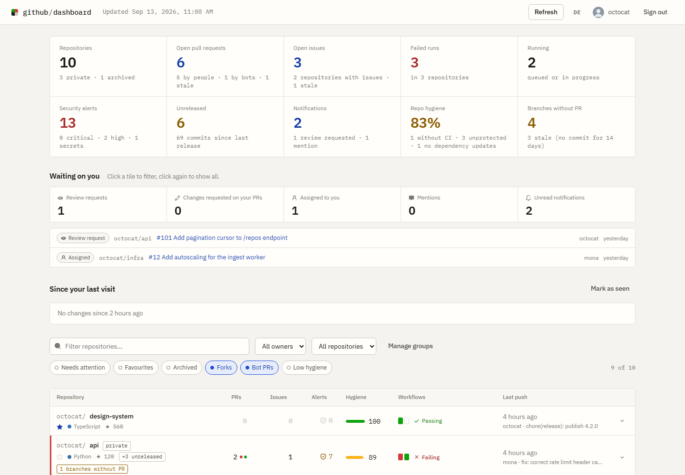

# github-dashboard

[](https://github.com/lukislp/github-dashboard/actions/workflows/ci.yml)
[](https://securityscorecards.dev/viewer/?uri=github.com/lukislp/github-dashboard)
[](https://github.com/lukislp/github-dashboard/security/code-scanning)
[](https://github.com/lukislp/github-dashboard/releases)
[](LICENSE)
[](pyproject.toml)
[](https://github.com/lukislp/github-dashboard/pkgs/container/github-dashboard)

Every repository you can reach on GitHub on one screen: open pull requests, open issues, the last
five workflow runs of each repository, and the totals across all of them. Multi-user: each person
signs in with their own GitHub account and sees exactly what that account sees. Nothing is loaded
without a login.



## What it shows

- **Totals**: repositories, open pull requests, open issues, failed runs, running runs, open
  security alerts, unreleased commits, unread notifications.
- **Repository table**, sortable and filterable (search, owner, archived, forks, "needs attention").
  Each row expands into the open pull requests, open issues and recent runs of that repository,
  plus its Dependabot/code-scanning/secret-scanning alert counts and release status.
- **Failed runs feed** across all repositories, newest first.
- **CI time this month**, split into private and public, per repository and as account totals;
  measured by timing the runs ourselves, because GitHub's own Actions billing endpoints refuse
  to answer for this app (see "Actions time" below).
- UI in English and German (toggle in the header), light and dark mode follow the system.

**When is a repository "failing"?** When at least one of its last `RUNS_PER_REPO` (default 5)
workflow runs concluded with `failure`, `timed_out` or `startup_failure`, regardless of branch.
The five runs are drawn as a small history strip in the table; hover shows workflow and result.

### Repository hygiene

Each non-archived, non-forked repository gets a hygiene score (0-100%) from up to nine
checks, read from a second, separately batched GraphQL query (`nodes(ids: ...)`, 25
repositories per request) that runs concurrently with the per-repository REST calls, under the same
concurrency limit. Keeping it out of the main repositories query means a slow or failing
hygiene lookup can never take down the rest of the overview (see "Architecture" below):

1. **readme** - a `README.md` exists at the repository root.
2. **license** - GitHub detected a license (`licenseInfo`).
3. **ci_workflow** - `.github/workflows` contains at least one `.yml`/`.yaml` file.
4. **dependency_updates** - a Dependabot (`.github/dependabot.yml`/`.yaml`) or Renovate
   (`renovate.json`, `.github/renovate.json`, `.renovaterc.json`) configuration is present.
5. **branch_protection** - at least one branch protection rule or ruleset is configured.
6. **vulnerability_alerts** - Dependabot alerts are enabled for the repository.
7. **delete_branch_on_merge** - merged branches are deleted automatically.
8. **security_policy** - a `SECURITY.md` exists (root or `.github/`).
9. **codeowners** - a `CODEOWNERS` file exists (root or `.github/`). **Conditional**: this
   check is only evaluated for repositories more than one person can contribute to (GitHub's
   `collaborators` count is above one). A CODEOWNERS file only does one thing - request a
   review automatically when *someone else* opens a pull request - and GitHub never requests a
   review from a pull request's own author, so in a one-person repository the file would sit
   there with no effect. Where the check does not apply it is left out of the check list
   entirely, so it counts in neither the numerator nor the denominator of the score. This is
   not a way to hide a failing check: the other eight always apply, and `codeowners` returns
   by itself as soon as a second person has access. If GitHub does not report the collaborator
   count (the field needs push access), the check is skipped rather than guessed.

Archived repositories and forks still have their checks computed but are marked "not
applicable" with a fixed score of 100, so the UI can grey them out instead of penalising them
(archived repositories are skipped from the hygiene query entirely; forks are still fetched,
since applicability there depends on a field the query itself returns). Set
`HYGIENE_CHECKS=false` to skip the hygiene query altogether (every repository is then reported
as not applicable, with no checks). Hygiene contributes four totals (`repos_without_ci`,
`repos_without_protection`, `repos_without_dependency_updates`, `repos_without_license`) and an
account-wide `hygiene_average`, both computed only over applicable repositories.

**Graceful degradation**: if a hygiene batch of 25 fails with a transient error (HTTP
502/503/504, or GitHub's `RESOURCE_LIMITS_EXCEEDED` partial error), it is retried once after a
one-second wait, split into two halves of up to 13 repositories each. A half that still fails
is dropped for that refresh: its repositories are simply reported as "hygiene not applicable"
with no branch data, rather than failing the whole overview. An authentication failure or an
exhausted rate limit still propagates and fails the refresh, same as everywhere else.

### Actions usage

Every run's observed `duration_seconds` (`updated_at` minus `run_started_at`, 0 while it is
still active) is summed into `RepoCi.ci_seconds_recent` and `Totals.ci_seconds_recent`. This
works with the scopes we have and is the honest number; the billing endpoint
(`GET /users/{login}/settings/billing/actions`, exposed as `Overview.actions_usage`) is a
bonus on top of it - it may be unavailable (`actions_usage.available: false`) because the
requested OAuth scopes do not include `user`, which is not a scope this app otherwise needs.
Set `ACTIONS_USAGE=false` to skip that call altogether.

### Actions time

GitHub's own Actions billing is not readable by this app for the account it was built for,
and it is worth being explicit about that rather than showing a number that looks precise but
is not: on the newer billing platform, `GET /users/{login}/settings/billing/actions`,
`/settings/billing/usage` and `/settings/billing/shared-storage` all answer `404` for a token
without the `user` OAuth scope (which this app otherwise has no reason to request), and the
one endpoint that *does* answer for such a token, `GET /repos/{owner}/{repo}/actions/runs/{id}/
timing`, reports `billable: 0 ms` for every run on that platform - so even when it is
reachable, it has nothing in it. `Overview.actions_usage` above is that best-effort attempt;
this feature does not depend on it and reports nothing where it, too, would report nothing.

Instead, `Totals.ci_seconds_month`/`ci_seconds_month_private`/`ci_seconds_month_public` and
`Totals.ci_runs_month`, plus a per-repository `RepoOverview.usage` (`RepoUsage.seconds`/`runs`/
`truncated`), are wall-clock time measured directly from the workflow runs of the **current
calendar month** (`Overview.usage_since`, the first of the month at midnight UTC). On the
standard `ubuntu` runners this account uses, wall-clock time is exactly what GitHub bills per
minute; it is **not** the billed time on `macos` or `windows` runners, which GitHub multiplies
by ten and two respectively before billing. At most 200 runs per repository per month are
counted (two pages of 100); a repository that had more than that reports `truncated: true` and
undercounts the true total for the month.

Only non-archived repositories that actually have a CI workflow are queried at all: with
`HYGIENE_CHECKS` on, that fact comes straight out of the hygiene fetch (see "Repository
hygiene" above) for free; with `HYGIENE_CHECKS` off there is no such hint, so every
non-archived repository is queried instead. Set `CI_USAGE=false` to skip this feature
altogether - every repository then reports zero and `Overview.usage_since` is `null`.

### Branches without a pull request

Each repository also reports its branches (other than the default one) that have no open or
closed pull request pointing at them, oldest last-commit first, fetched by the same hygiene
query described above (no extra API call). Branch data is limited to the first 50 branches per
repository (a GraphQL page limit chosen to keep each hygiene batch's cost and latency
predictable); repositories with more branches than that will under-report
`branches_without_pr` for the branches beyond the first 50, though `branch_count` always
reflects the true total. If a repository's hygiene batch could not be recovered this refresh
(see "Graceful degradation" above), it is reported with `branch_count` 0 and no branches
instead.

## Setup

### 1. Create a GitHub OAuth App

GitHub → Settings → Developer settings → OAuth Apps → *New OAuth App*.

| Field | Value |
|---|---|
| Homepage URL | `https://dashboard.example.com` (or `http://localhost:8000`) |
| Authorization callback URL | `<Homepage URL>/auth/callback` |
| Expire user access tokens | Optional. When enabled, GitHub issues short-lived (8h) tokens plus a refresh token instead of a non-expiring one; the app refreshes automatically either way (see "Security notes"). |

Copy the client ID and generate a client secret.

### 2. Configure

```bash
cp .env.example .env
python -c "import secrets; print(secrets.token_urlsafe(48))"   # -> SECRET_KEY
```

| Variable | Required | Default | Purpose |
|---|---|---|---|
| `GITHUB_CLIENT_ID` | yes | | OAuth App client ID |
| `GITHUB_CLIENT_SECRET` | yes | | OAuth App client secret |
| `SECRET_KEY` | yes | | Signs cookies, encrypts tokens at rest (min. 32 chars) |
| `BASE_URL` | yes | | Public URL; callback is `<BASE_URL>/auth/callback` |
| `GITHUB_SCOPES` | no | `repo read:org security_events notifications` | `repo` is needed for private repositories and their runs; `security_events` for code/secret-scanning alerts; `notifications` for the notifications feed |
| `ALLOWED_LOGINS` | no | *(everyone)* | Comma-separated GitHub logins allowed to sign in |
| `CACHE_TTL_SECONDS` | no | `120` | How long an overview is served from cache |
| `SESSION_TTL_HOURS` | no | `168` | Login lifetime |
| `RUNS_PER_REPO` | no | `5` | Recent runs inspected per repository |
| `MAX_CONCURRENCY` | no | `8` | Parallel GitHub requests per refresh |
| `STALE_DAYS` | no | `14` | Days without activity before a PR/issue is flagged stale |
| `LONG_RUN_MINUTES` | no | `30` | Minutes an active run may run before it is flagged long-running |
| `SECURITY_ALERTS` | no | `true` | Fetch code-scanning and secret-scanning alerts per repository (`true`/`false`/`1`/`0`) |
| `HYGIENE_CHECKS` | no | `true` | Score each repository's hygiene from the batched GraphQL query (`true`/`false`/`1`/`0`); when `false` every repository is reported as not applicable instead |
| `BACKGROUND_REFRESH` | no | `true` | Keep recently active users' overview cache warm in the background (`true`/`false`/`1`/`0`) |
| `BACKGROUND_REFRESH_SECONDS` | no | `240` | Seconds between background-refresh ticks (minimum `60`) |
| `BACKGROUND_REFRESH_IDLE_MINUTES` | no | `30` | Only refresh sessions seen within this many minutes (minimum `1`) |
| `MAX_JOB_LOOKUPS` | no | `20` | Failed runs (newest first, across the whole refresh) whose failed jobs/steps are looked up per refresh (minimum `0`, `0` disables the feature) |
| `ACTIONS_USAGE` | no | `true` | Fetch GitHub Actions billing usage for the signed-in user (`true`/`false`/`1`/`0`); skipped entirely when `false` |
| `CI_USAGE` | no | `true` | Measure each repository's wall-clock Actions time for the current calendar month (`true`/`false`/`1`/`0`, see "Actions time"); skipped entirely when `false` |
| `DB_PATH` | no | `./data/sessions.db` | SQLite session store (single replica) |
| `REDIS_URL` | no | | Redis for sessions and cache (multiple replicas) |

### 3. Run

Locally:

```bash
uv sync
uv run uvicorn app.main:app --reload --port 8000
```

Docker:

```bash
docker compose up --build
```

Kubernetes (single replica, Longhorn PersistentVolumeClaim for SQLite, Flux keeps it in sync):

```bash
kubectl apply -f k8s/00-namespace.yaml
bash k8s/seal-secret.sh                     # OAuth App credentials -> k8s/02-sealed-secret.yaml
kubectl apply -f k8s/02-sealed-secret.yaml  # or create the Secret out of band, see k8s/02-secret.yaml
kubectl apply -f k8s/04-network-policies.yaml -f k8s/05-httproute.yaml
kubectl apply -f k8s/flux/                  # GitRepository + Kustomization -> k8s/flux-deploy/
```

`k8s/` follows the convention of the other apps on this cluster: namespace, Secret, network
policies and the HTTPRoute are bootstrap objects applied once by hand (the Flux reconciler's
ClusterRole deliberately cannot manage them); `k8s/flux-deploy/` (ConfigMap, PVC, Deployment,
Service) is reconciled continuously, including the image tag the CI pipeline's `deploy-bump` job
writes into `k8s/03-app.yaml` on every release. Adjust `BASE_URL`/`ALLOWED_LOGINS` in
`k8s/01-config.yaml` and the hostnames in `k8s/05-httproute.yaml` for another cluster. For more
than one replica set `REDIS_URL`, drop the PVC volume and switch the Deployment strategy to
`RollingUpdate`. The container runs as a non-root user with a read-only root filesystem; `/data`
and `/tmp` are the only writable paths. `/healthz` is the liveness probe, `/readyz` touches the
session store.

## Security notes

- OAuth authorization-code flow with a signed, short-lived `state` cookie.
- The session cookie carries only a signed session ID (`HttpOnly`, `SameSite=Lax`, `Secure` on HTTPS).
- GitHub tokens are stored Fernet-encrypted, keyed from `SECRET_KEY`. Rotating the key invalidates
  all sessions.
- Signing out deletes the session and revokes the token at GitHub.
- A `401` from GitHub (token revoked in your GitHub settings) deletes the session immediately.
- Expiring tokens ("Expire user access tokens" in the OAuth App) are supported: the refresh
  token is stored encrypted alongside the access token and rotated on every refresh.
- Strict Content-Security-Policy; no inline scripts, no third-party requests. IBM Plex Sans/Mono
  are self-hosted under `app/web/static/fonts/` (SIL Open Font License 1.1, see
  `app/web/static/fonts/LICENSE.txt`).
- No data is shared between users; the cache is keyed by GitHub user ID.
- `security_events` lets the app read Dependabot, code-scanning and secret-scanning alerts;
  `notifications` lets it read (but never mark read/unsubscribe) your notifications feed. Both
  are read-only. If a signed-in token lacks either scope, or a repository has the underlying
  feature disabled, that part is simply omitted (shown as unavailable, not zero).
- Each refresh now costs up to 4 REST requests per non-archived repository (workflow runs,
  code-scanning alerts, secret-scanning alerts, and a commit comparison for repositories with a
  release), plus up to 2 more for repositories with a CI workflow (`CI_USAGE`, see "Actions
  time"), on top of the batched GraphQL query. Set `SECURITY_ALERTS=false` to skip the two
  security REST calls per repository if that cost is too high for a large account.
- `POST /api/repos/{owner}/{name}/runs/{run_id}/rerun` is the only endpoint that writes to
  GitHub (it re-runs a run's failed jobs). It needs no scope beyond the `repo` scope already
  requested, and is guarded by the same same-origin check as every other state-changing
  endpoint (`PUT /api/preferences`, `POST /api/seen`).
- Failed jobs and their first failing step are looked up for the newest failed runs across the
  whole refresh, capped by `MAX_JOB_LOOKUPS` (default 20) rather than per repository, to bound
  the extra REST cost on accounts with many failing repositories.

## Per-user state

The dashboard remembers two things per signed-in GitHub account, independent of any session:

- **Preferences**: your custom repository groups and favourites (`GET`/`PUT /api/preferences`).
- **Snapshot**: the identity of everything you had already seen (open PRs/issues, failed runs,
  inbox items, notifications, repositories with open security alerts) as of your last
  `POST /api/seen`. Every `GET /api/overview` diffs the current data against it and returns the
  result as `changes`, so the UI can highlight what is new since your last visit.

Both are keyed by GitHub user ID, stored in the same place as sessions (the SQLite file, or Redis
when `REDIS_URL` is set), and **survive logout and re-login** — they are wiped only if you delete
the underlying store.

## Architecture

```
app/
  domain/          models, aggregation (build_overview), snapshot/diff, JSON codec — pure, no I/O
  application/     use cases (CompleteLogin, GetOverview, GetChanges, SavePreferences…), the
                   in-memory session-activity tracker feeding the background refresh, and ports
  infrastructure/  adapters: GitHub HTTP (GraphQL + REST, with a conditional-request ETag
                   cache), SQLite/Redis sessions and user state, memory/Redis overview cache,
                   Fernet cipher, settings from env
  web/             FastAPI routers (incl. /api/preferences, /api/seen), composition root
                   (container.py), templates, static assets
tests/
  unit/            domain + use cases with in-memory fakes
  integration/     adapters (respx-mocked GitHub, SQLite, fakeredis) and HTTP routes
  contract/        against the real GitHub API; runs only when GH_TOKEN is set
```

Dependencies point inwards only. Repositories with their open PR/issue counts, Dependabot alert
counts and latest release come from one paginated GraphQL query (50 repositories per page).
Hygiene facts (license/workflows/dependency-update config/branch protection/rulesets/security
policy/CODEOWNERS) and branches without a pull request come from a second, separately batched
GraphQL query (`nodes(ids: ...)`, 25 repository ids and 50 branch refs per request), run
concurrently with the per-repository REST work under the same concurrency limit; a batch that
fails transiently is retried once, split in half, before degrading gracefully rather than
failing the whole overview (see "Repository hygiene" above). Splitting hygiene out of the
repositories query keeps the latter small and fast — combining everything into one query used
to intermittently hit GitHub's per-query resource limits. Workflow runs, code/secret scanning
alerts and unreleased-commit counts come from the REST API, fetched concurrently with a
semaphore. Archived repositories are not queried for runs, security alerts, release status or
hygiene.

Every one of those REST calls rides on conditional requests: an `ETag` from a previous
response is sent back as `If-None-Match`, and an unchanged resource comes back as a `304` with
an empty body instead of a full `200` - which, unlike a `200`, does not count against the
token's REST rate limit. A small bounded LRU (`app/infrastructure/http_cache.py`, 2000 entries
by default) holds the ETag and parsed body per `(token, url)` pair, so a repeat refresh of an
account that has not changed since the last one is almost free. GraphQL is not covered by this
- GitHub does not support conditional requests for it - so the two GraphQL queries above are
still paid on every refresh.

The background refresh (`BACKGROUND_REFRESH`, on by default) is what makes that saving pay off
for the person actually using the dashboard: every `BACKGROUND_REFRESH_SECONDS`, one process
tracks which sessions were seen in the last `BACKGROUND_REFRESH_IDLE_MINUTES` and force-refreshes
their overview cache, one session after another. Only users who were actually looking recently
get warmed, and each warming refresh is cheap precisely because of conditional requests above -
so by the time someone reloads the page, the overview is very likely already sitting in cache
instead of triggering a 7-10s live fetch. The tracker is in-memory per process (see
`app/application/activity.py`); with several replicas each one warms only the sessions it
happens to see traffic for.

## Development

```bash
uv run ruff check app tests fuzz && uv run ruff format --check app tests fuzz
uv run pytest -q
GH_TOKEN=$(gh auth token) uv run pytest -q tests/contract   # optional live check
```

`fuzz/fuzz_parsers.py` is an [Atheris](https://github.com/google/atheris) harness over the code
that turns outside input into domain objects - the environment loader in
`app/infrastructure/settings.py` and the encoders/decoders in `app/domain/codec.py`. It asserts
the bounds `Settings.from_env` documents, that the codec round trips, and that the decoders
reject a corrupted cache entry by raising something the callers already handle. CI runs it for
30 seconds on every push; to run it locally (Linux only - there is no atheris wheel for
Windows):

```bash
pip install --require-hashes -r requirements_fuzz.txt
PYTHONPATH=. python fuzz/fuzz_parsers.py -max_total_time=60
```

## Releases and images

Versions are cut by [semantic-release](https://semantic-release.gitbook.io/) from
[Conventional Commit](https://www.conventionalcommits.org/) messages on `main` - see
[CHANGELOG.md](CHANGELOG.md) for the generated history. Each release publishes a multi-arch
(`linux/amd64` + `linux/arm64`) image to `ghcr.io/lukislp/github-dashboard`, tagged `latest` and
`vX.Y.Z`, with an SBOM and SLSA provenance attestation attached and a Sigstore keyless signature
on the manifest. Verify it before pulling:

```bash
cosign verify \
  --certificate-identity-regexp 'https://github.com/lukislp/github-dashboard/' \
  --certificate-oidc-issuer https://token.actions.githubusercontent.com \
  ghcr.io/lukislp/github-dashboard:<tag>
```

## Security

See [SECURITY.md](SECURITY.md) for how to report a vulnerability.

## Contributing

See [CONTRIBUTING.md](CONTRIBUTING.md).

## License

MIT
